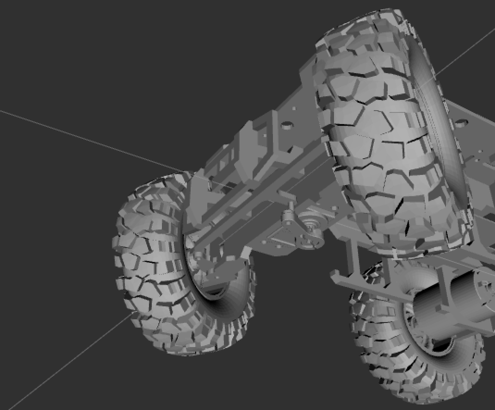

# rc-model

_Jason Klein (Spring 2024)_

URDF model of the rc cars for use in simulators. Exported from Fusion360 CAD model using [fusion2urdf](https://github.com/syuntoku14/fusion2urdf/blob/master/URDF_Exporter/core/Joint.py), with additional post-processing tweaks to get the Ackermann linkage lined up correctly. More detail on these steps is in [Modification](#modification).



## Installation

Make sure you have Gazebo installed (the model has only been tested in [Gazebo Classic](https://classic.gazebosim.org/tutorials?tut=ros_wrapper_versions&cat=connect_ros#InstallingGazebo)). Globally install the necessary packages with

```bash
sudo apt install ros-noetic-gazebo-ros-pkgs
```

In order to use `mimic` joint constraints in Gazebo, you'll need to clone [this repo](https://github.com/roboticsgroup/roboticsgroup_upatras_gazebo_plugins) into your `src/` directory, install `ros-noetic-control-toolbox`, and then build with `catkin_make`.

You might also need

- `ros-noetic-joint-state-publisher`
- `ros-noetic-robot-state-publisher`
- `ros-noetic-controller-manager`
- `ros-noetic-gazebo-ros-control`
- `ros-noetic-joint-state-controller`
- `ros-noetic-effort-controllers`

## Usage

To preview the URDF in RViz and expose a joint publisher, run the `display.launch` file from the `rc_model` package using

```bash
roslaunch rc_model display.launch
```

> [!NOTE]
> Very little experimentation has been done with Gazebo integration so far, but that will be documented here once we know more about it.

## Modification

The original CAD file is [here](https://a360.co/4aprIy8). In order to make the URDF export process easier, that file was heavily modified, and all of the bodies were joined together into a minimal set of components with extraneous holes removed. The modified CAD file is [here](https://a360.co/3PVAXOs).

In order to get the Ackermann linkage working properly in ROS/Gazebo, it has to be faked, because URDF doesn't support four-bar linkages. Fortunately, the servo horn and left/right wheel mounts always share the same rotation, so a couple [mimic joints](https://wiki.ros.org/urdf/XML/joint) allow it to be simulated properly.

There's also an [issue](https://github.com/syuntoku14/fusion2urdf?tab=readme-ov-file#before-using-this-script) with the exporter in that joint offset transforms don't get saved, so the second CAD file was particular with the order of joints and transforms.
